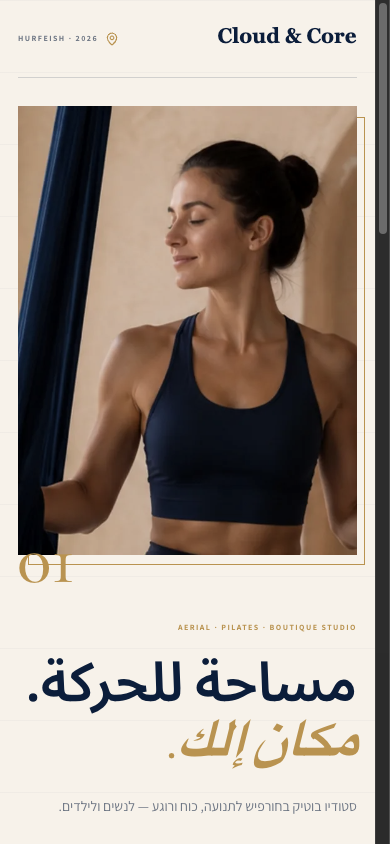
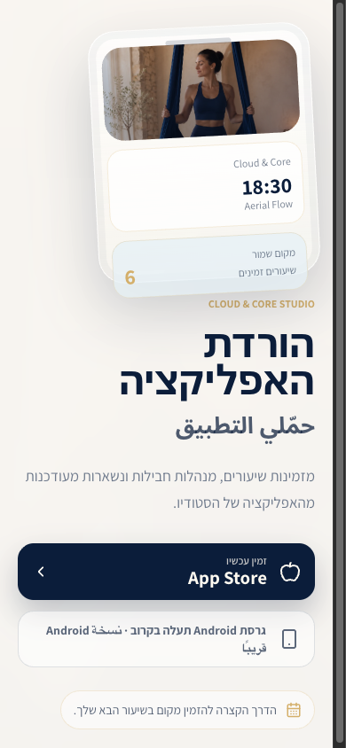
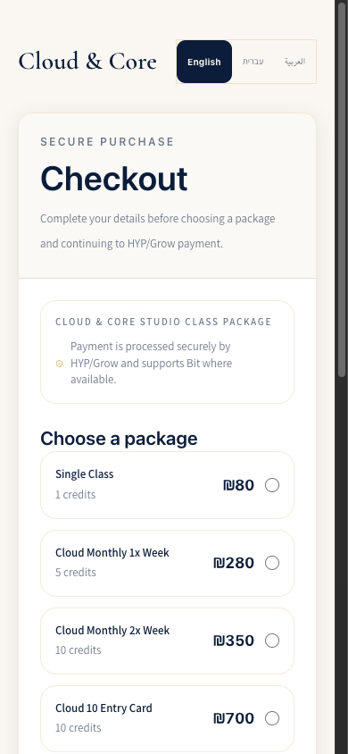
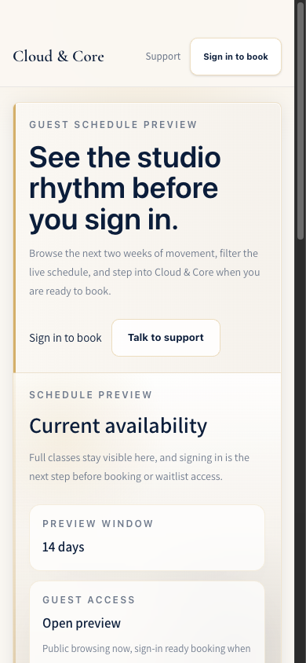

# Premium Mobile Roadmap: Cloud & Core Studio

## Verdict

**Premium readiness: 7.8/10**

Cloud & Core already has a distinct boutique-studio identity. The navy, warm ivory, restrained gold, editorial photography, and multilingual voice feel considered. The Instagram and app-download pages are the strongest expressions of the brand.

The product loses premium credibility where the interface must feel dependable: sign-in, guest schedule, signup, checkout, and cross-page consistency. Premium is mostly reliability plus restraint. Fixing trust defects will move the product further than adding more visual decoration.

## Design Grades

| Category                      | Grade | Evidence                                                                        |
| ----------------------------- | ----- | ------------------------------------------------------------------------------- |
| Brand distinction             | A-    | Instagram and download pages feel specific to Cloud & Core                      |
| Visual hierarchy              | B     | Strong headings and CTAs, but schedule/support become card-heavy                |
| Typography                    | B-    | Clear hierarchy, but 15px body and 12–13px utility text feel small              |
| Color and contrast            | C+    | Palette is coherent; muted text measured about 4.06:1                           |
| Spacing and responsive layout | B+    | No horizontal overflow at 375/390/430px                                         |
| Interaction quality           | B     | Core controls work; auth readiness still delays the highest-intent flow         |
| Localization                  | C+    | RTL layout works; Arabic conversion copy remains partly English                 |
| Motion                        | B     | Reduced motion is respected; the product could use a few purposeful transitions |
| Performance feel              | B     | Most pages are fast, but auth readiness adds an avoidable six-second wait       |
| AI-template resistance        | A-    | Editorial pages feel authored; app pages still lean on repeated rounded cards   |

## First Impression

The product communicates a calm, boutique movement studio with credible photography and a controlled palette.

My eye goes to:

1. The Cloud & Core mark
2. The editorial image or large navy headline
3. The primary navy action

That hierarchy is right. The weak point appears after the first impression, when users encounter small utility text, repetitive bordered containers, and a long auth readiness delay.

One-word verdict: **promising**.

## What Already Feels Premium

- The Instagram landing page has the strongest point of view. It uses editorial composition, large Arabic typography, authentic photography, and asymmetric section pacing.
  
- The download page presents one focused task with a convincing device visual and a strong App Store action.
  
- The checkout palette and package presentation feel calm and trustworthy in English.
  
- The mobile layouts do not horizontally overflow at the audited widths.
- Keyboard focus is visible, and reduced-motion preferences are respected.

## Priority 0: Restore Trust

These are prerequisites for premium perception.

1. Remove the six-second guest-session retry loop so confirmed signed-out visitors see the form immediately.
2. Give the public class card a specific accessible name that includes class, time, and action, and expose that it opens a dialog.
3. Add a real-browser regression test that taps the class card and verifies the detail sheet.

## Priority 1: Create One Public Design System

Privacy, support, checkout, auth, schedule, terms, Instagram, and download currently feel like related but separately designed products.

Use one shared public shell:

- A consistent brand header and language control
- One heading scale
- One body and muted-text scale
- Shared link, button, and focus states
- Consistent footer navigation and localization
- A single border-radius hierarchy instead of similar rounded cards everywhere

The shared shell should be extracted over time so legal and conversion pages cannot drift as they evolve.

## Priority 2: Make Mobile Type Feel Expensive

Premium mobile products rarely ask users to work to read.

- Raise body copy from 15px to at least 16px.
- Keep utility labels at 13–14px only when contrast is comfortably above 4.5:1.
- Darken the muted gray currently measuring about 4.06:1 on ivory.
- Use the brand serif or another expressive display face for a small number of major public headings, while keeping the functional sans for forms and schedules.
- Shorten line lengths and reduce repeated explanatory copy on the guest schedule.

## Priority 3: Flatten the Card Stack

The schedule is readable, but it nests a hero card, preview-stat cards, filter card, filter rows, and class cards. This makes a boutique product feel like a dashboard template.

Keep cards only where the card is the interaction:

- Class session: card is justified
- Package choice: card/radio is justified
- Support channel: card is justified
- Hero, section intro, filter wrapper, and simple statistics: use open layout, rules, typography, and whitespace instead

The goal is fewer boxes and stronger composition.

## Priority 4: Finish Localization as Product Design

RTL direction works well, but translation stops midway through conversion flows.

- Translate “Checkout” in Arabic and Hebrew navigation.
- Translate package names and “credits,” or define intentional bilingual names.
- Replace browser-native validation with localized inline messages.
- Verify price and number ordering in RTL package rows.
- Review Arabic and Hebrew line breaks at 375px.

## Priority 5: Upgrade Interaction Feel

Use motion sparingly:

- 150–220ms pressed feedback for buttons and selectable cards
- A short crossfade/slide between sign-in, signup, and reset states
- A bottom-sheet class detail transition on mobile
- A clear success transition after form submissions

Avoid adding decorative motion. The site already has enough atmosphere from its imagery and typography.

## Recommended Mobile Class Detail

When a guest taps a class:

1. Open a bottom sheet with class image, name, instructor, date/time, duration, level, room, and remaining spots.
2. Explain what to bring and who the class suits in two short lines.
3. Keep one sticky primary action: “Sign in to book.”
4. Preserve the user’s schedule filters and scroll position when they return.

This single interaction would connect the strongest brand asset, class photography, to the highest-intent public workflow.

## Quick Wins

1. Increase shared body text to 16px and enlarge all touch targets to 44px.
2. Darken muted text until all normal copy passes 4.5:1.
3. Complete Arabic/Hebrew footer and package localization.
4. Give signup name and email fields proper autofill attributes.
5. Add real-browser regression coverage for auth readiness and the guest class-detail sheet.

## Suggested Delivery Order

| Phase            | Outcome                                                       |
| ---------------- | ------------------------------------------------------------- |
| 1. Reliability   | Fix auth readiness and add browser-level interaction coverage |
| 2. Accessibility | Type, contrast, touch targets, accessible names               |
| 3. Localization  | Complete Arabic/Hebrew conversion surfaces                    |
| 4. System polish | Unify public shell and flatten unnecessary cards              |
| 5. Delight       | Class bottom sheet and a few purposeful transitions           |

## Target

After the reliability, accessibility, and localization phases, the realistic target is:

- **Health score:** 93 → 97+
- **Premium readiness:** 7.8 → 9.0
- **Design grade:** B → A-
- **AI-template resistance:** A- → A
