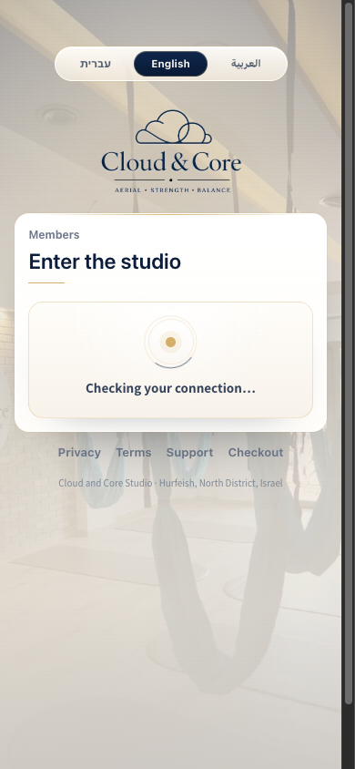
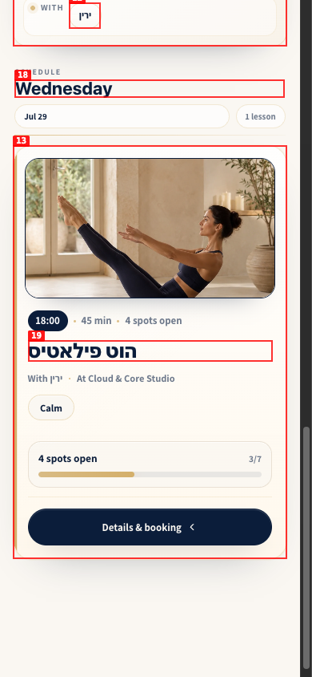
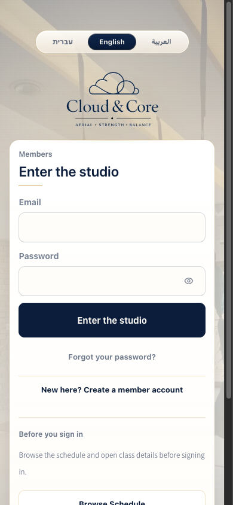
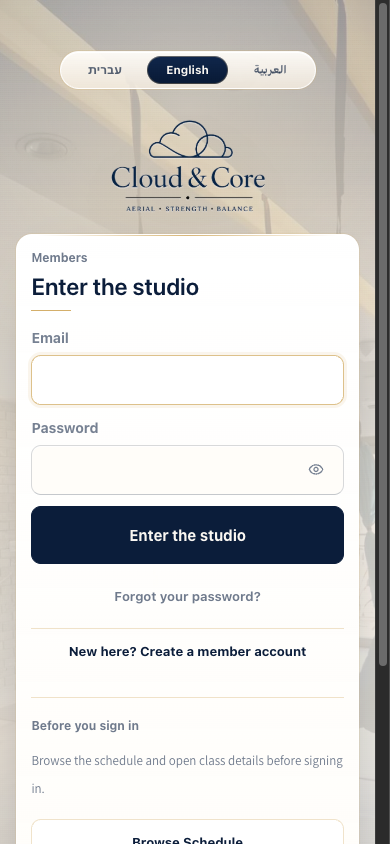
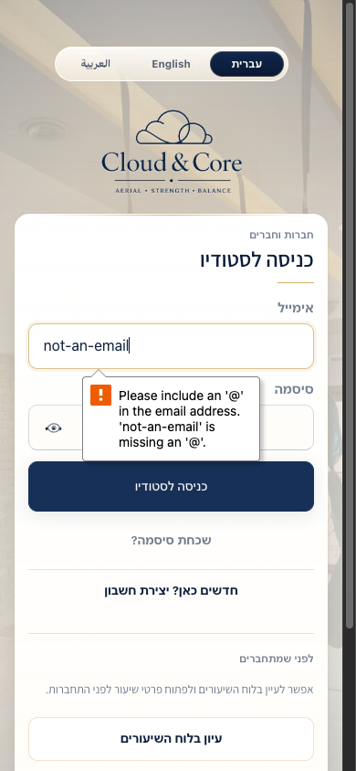
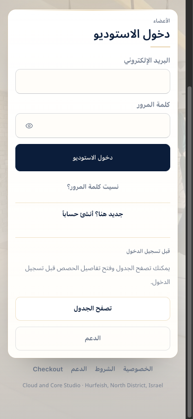
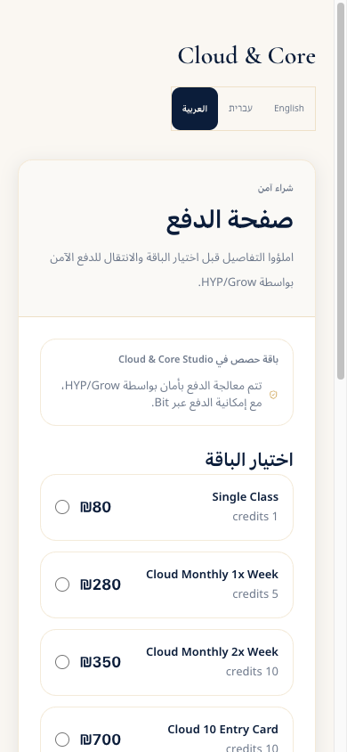
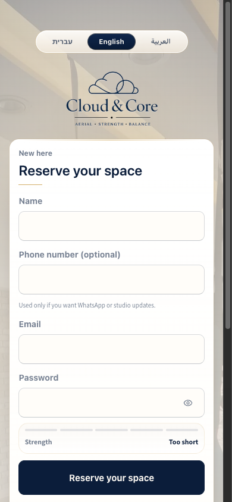

# Deep Mobile QA Report: Cloud & Core Studio

| Field                    | Value                                                                                        |
| ------------------------ | -------------------------------------------------------------------------------------------- |
| **Date**                 | 2026-07-29                                                                                   |
| **URL**                  | `http://127.0.0.1:8080`                                                                      |
| **Branch**               | `main`                                                                                       |
| **Commit**               | Started on `345e26f`; branch advanced to `5a8ee55` during the audit                          |
| **Tier**                 | Exhaustive, public and pre-auth mobile surfaces                                              |
| **Scope**                | 375px, 390px, and 430px widths; Hebrew, English, and Arabic; public and authentication flows |
| **Pages/states visited** | 13                                                                                           |
| **Framework**            | React 19, TanStack Start/Router, Vite                                                        |

## Health Score: 93/100

This is the corrected pre-fix baseline. All six confirmed findings were remediated on 2026-07-29 and passed targeted production verification.

| Category      | Score |
| ------------- | ----- |
| Console       | 100   |
| Links         | 100   |
| Visual        | 92    |
| Functional    | 100   |
| UX            | 81    |
| Performance   | 92    |
| Content       | 92    |
| Accessibility | 84    |

## Top 3 Things to Fix

1. **ISSUE-001: Signed-out visitors wait about six seconds for sign-in** — a retry loop keeps checking for a session even after the app has confirmed there is no refresh cookie.
2. **ISSUE-004: Mobile text, contrast, and tap targets miss accessibility minimums** — muted copy measures about 4.06:1 and several auth controls are below 44px.
3. **ISSUE-006: Arabic localization is incomplete on conversion surfaces** — checkout package names, credit labels, and a footer link remain English.

## Console Health

| Error | Count | First seen |
| ----- | ----- | ---------- |

No shipping console error was reproduced in the production build. A hydration warning appeared once under the Vite development server, but production verification showed no hydration mismatch and confirmed that it was not the cause of the auth delay.

## Summary

| Severity  | Count |
| --------- | ----- |
| Critical  | 0     |
| High      | 0     |
| Medium    | 5     |
| Low       | 1     |
| **Total** | **6** |

## Coverage

- Authentication: sign-in, signup, forgot-password, expired reset link
- Public schedule: search, empty search, filters, class card
- Public support, privacy, terms, checkout, payment-result state
- Instagram landing page and app-download page
- Hebrew, English, and Arabic direction/localization checks
- Keyboard focus, touch targets, text contrast, horizontal overflow, and local Core Web Vitals

Authenticated member, instructor, and admin areas were not tested because no authenticated browser state or test credentials were available.

Production verification after `main` advanced to `5a8ee55` corrected three initial observations: the signup return control works when scrolled into view; the class-card click failure was not confirmed and its source is correctly wired to the detail sheet; and the terms page uses the same branded shell as the other legal page. Those observations are not counted as product defects.

## Issues

### ISSUE-001: Signed-out visitors wait about six seconds for sign-in

| Field        | Value            |
| ------------ | ---------------- |
| **Severity** | medium           |
| **Category** | performance / UX |
| **URL**      | `/auth`          |

**Description:** Production verification showed the email field appearing at approximately 8.3 seconds after navigation, after the page had already been loaded for about two seconds. The source retries session restoration every 650ms for up to 6 seconds even when `getFreshSupabaseSession()` has returned `null` and no refresh cookie exists. A confirmed guest should see the form immediately.

**Repro Steps:**

1. Navigate to `/auth` in a 390×844 viewport.
2. Observe that the form is replaced by a connection-check panel.
   
3. At 3.8 seconds, query for the email input. It is still absent.
4. After the six-second restore loop expires, the email input appears.
   

---

### ISSUE-002: Public class card has no explicit accessible name

| Field        | Value              |
| ------------ | ------------------ |
| **Severity** | medium             |
| **Category** | accessibility      |
| **URL**      | `/member/schedule` |

**Description:** The class-card wrapper is a keyboard-operable `div role="button"` and is correctly wired to open `ClassDetailSheet`, but it has no explicit accessible name or dialog relationship. The initial tap failure was an automation artifact and is not counted as a functional defect.

**Repro Steps:**

1. Navigate to `/member/schedule` and scroll to the class card.
   
2. Inspect the accessibility tree.
3. **Observe:** the wrapper is exposed as a generic button without a class-specific label or `aria-haspopup="dialog"`.

---

### ISSUE-004: Mobile text, contrast, and tap targets miss accessibility minimums

| Field        | Value                 |
| ------------ | --------------------- |
| **Severity** | medium                |
| **Category** | accessibility         |
| **URL**      | Multiple public pages |

**Description:** The rendered body font is 15px on audited pages. On `/auth`, muted labels, instructions, and footer links measured approximately 4.06:1 against the ivory surface, below the 4.5:1 WCAG AA threshold for normal text. The language buttons are 28px high, the password visibility button is 35×35px, auth secondary actions are 38–40px high, and footer links are roughly 21px high, all below the 44px mobile target.

**Evidence:**

- The sign-in form uses small muted text throughout.
  
- The keyboard focus treatment is visible and passed the manual tab check.
  

---

### ISSUE-005: Browser validation breaks the selected language

| Field        | Value        |
| ------------ | ------------ |
| **Severity** | medium       |
| **Category** | UX / content |
| **URL**      | `/auth`      |

**Description:** In the Hebrew sign-in experience, entering an invalid email produces the browser’s native English message: “Please include an '@' in the email address.” Users who selected Hebrew or Arabic can receive validation guidance in a different language.

**Repro Steps:**

1. Select Hebrew.
2. Enter `not-an-email` and submit.
3. **Observe:** the validation tooltip is in English while the surrounding interface is Hebrew.
   

---

### ISSUE-006: Arabic localization is incomplete on conversion surfaces

| Field        | Value                |
| ------------ | -------------------- |
| **Severity** | medium               |
| **Category** | content              |
| **URL**      | `/auth`, `/checkout` |

**Description:** The Arabic auth footer leaves “Checkout” in English. On Arabic checkout, the heading, fields, and legal consent are Arabic, but every package name and the word “credits” remain English. This makes the purchase flow feel partially translated.

**Evidence:**

- Arabic auth footer with English “Checkout.”
  
- Arabic checkout with English package names and credit labels.
  

---

### ISSUE-008: Signup disables useful mobile autofill

| Field        | Value                |
| ------------ | -------------------- |
| **Severity** | low                  |
| **Category** | UX                   |
| **URL**      | `/auth` signup state |

**Description:** The signup `Name` and `Email` inputs render with `autocomplete="off"`. Password correctly uses `new-password`, and phone uses `type="tel"`. Disabling name and email autofill adds avoidable typing to a mobile conversion flow.

**Evidence:**

## Positive Findings

- No horizontal overflow was found at 375px, 390px, or 430px.
- Keyboard focus is visible and ordered logically on sign-in.
- Reduced-motion mode removed active CSS animations on the Instagram landing page.
- Local Core Web Vitals were fast once pages became ready: checkout LCP 540ms, Instagram LCP 616ms, public schedule LCP 492ms, with CLS 0 on each.
- `bun run build` completed successfully. It warned that the main client chunk exceeds 500kB before gzip, which should be watched under real mobile network throttling.
- The Instagram and download pages have a distinct editorial brand direction and avoid generic SaaS visual patterns.
- Empty schedule search includes a clear message, reset action, and sign-in path.

## Ship Readiness

| Metric                 | Value                |
| ---------------------- | -------------------- |
| Health score           | 93/100               |
| Issues found           | 6                    |
| Fixes applied          | 6                    |
| Authenticated coverage | Not completed        |

**Remediation verification:** Production build and lint passed. Focused auth, localization, schedule, and class-card tests passed. At 375×812 and 390×844 in English, Hebrew, and Arabic, the signed-out auth form was ready on the first production snapshot with no horizontal overflow. Body text measured 16px; muted text used `#5f6b7e`; and every audited auth target measured at least 44×44px. Hebrew invalid-email feedback rendered inline in Hebrew, and signup exposed `name`, `tel`, `email`, and `new-password` autofill tokens. Machine-readable measurements are in `post-fix-mobile-verification-2026-07-29.json`.

**PR Summary:** “Deep mobile QA confirmed and remediated 6 issues across public/pre-auth mobile surfaces. Production verification confirms immediate guest auth readiness, localized inline validation and checkout copy, accessible class-card naming, 16px base typography, WCAG AA muted-text contrast, 44×44px auth targets, and restored mobile autofill.”
