# Architecture

Cloud & Core uses **at-least-once processing with effectively-once customer-visible side
effects**.

```mermaid
flowchart LR
  A["Domain mutation"] --> B["Domain outbox in same PostgreSQL transaction"]
  B --> C["Leased outbox claim"]
  C --> D["Journey instance and intent"]
  D --> E["Reload current engagement state"]
  E --> F["Recipient-level arbitration"]
  F --> G["Atomic frequency reservation"]
  G --> H["Versioned decision and immutable snapshot"]
  H --> I["Independent deliveries"]
  I --> J["APNs / Resend / Meta"]
  J --> K["Signed, deduplicated, monotonic webhooks"]
```

Deterministic identifiers progress from domain event to journey, decision, snapshot, delivery,
and attempt. Database uniqueness and locks—not a claim of distributed exactly-once
execution—prevent duplicate visible effects.

Scheduled intents contain identities and cancellation conditions, not stale rendered member or
class data. The dispatcher reloads current state and arbitrates every eligible action for the
recipient. In-app evidence is committed independently of external transport success.

The existing cron and canonical messaging worker remain the runtime. PostgreSQL leases,
`SKIP LOCKED`, and a locked `recipient_contact_state` row provide concurrency control.

The concierge worker is exposed only through authenticated
`POST /api/internal/concierge/run`. It claims `domain_outbox` rows, normalizes each versioned
event, resolves the latest automation version, and then:

- postpones paused work without losing it;
- materializes an immutable shadow decision without a delivery;
- suppresses non-allowlisted test-only recipients;
- preserves allowlisted test-only work until test delivery materialization is available;
- preserves `live` work until the complete delivery runtime is available.

Claim ownership, journey/intent/decision writes, and outbox completion are checked and committed
by PostgreSQL functions. Retryable failures use bounded backoff. Permanent or exhausted failures
create an admin-attention item.

`POST /api/internal/concierge/dispatch` is the dispatch-time shadow evaluator. It reloads the
recipient, consent, exact-locale approved templates, channel controls, current intent evidence,
recent contacts, and push-token coverage before running recipient-level arbitration. The
database records one immutable, deterministic shadow decision and any missing-locale attention
item atomically. This path creates no snapshot, reservation, delivery, or provider call.
