# Architecture

Cloud & Core uses **at-least-once processing with effectively-once customer-visible side
effects**.

```mermaid
flowchart LR
  A["Domain mutation"] --> B["Domain outbox in same PostgreSQL transaction"]
  B --> C["Leased outbox claim"]
  C --> D["Journey instance and intent"]
  D --> E["Reload current engagement state"]
  E --> F["Recipient-level arbitration"]
  F --> G["Atomic frequency reservation"]
  G --> H["Versioned decision and immutable snapshot"]
  H --> I["Independent deliveries"]
  I --> J["APNs / Resend / Meta"]
  J --> K["Signed, deduplicated, monotonic webhooks"]
```

Deterministic identifiers progress from domain event to journey, decision, snapshot, delivery,
and attempt. Database uniqueness and locks—not a claim of distributed exactly-once
execution—prevent duplicate visible effects.

Scheduled intents contain identities and cancellation conditions, not stale rendered member or
class data. The dispatcher reloads current state and arbitrates every eligible action for the
recipient. In-app evidence is committed independently of external transport success.

The existing cron and canonical messaging worker remain the runtime. PostgreSQL leases,
`SKIP LOCKED`, and a locked `recipient_contact_state` row provide concurrency control.
