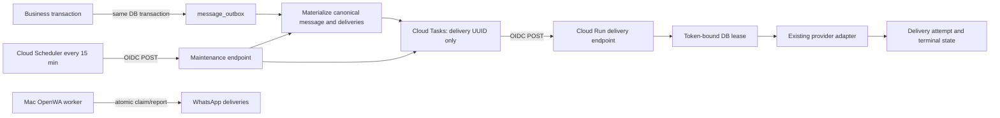

# Durable notification architecture

## Design

The durable database is the source of truth. The maintenance/post-commit orchestrator first runs the existing Concierge domain-event orchestration and materialization, then the canonical outbox materializer. Cloud Tasks is transport, not state. Every task contains only `{ "deliveryId": "<uuid>" }`; recipient addresses, payment details, and message content are loaded server-side after authorization and lease acquisition.

## State and idempotency

Outbox facts are append-only for business fields. `deduplication_key` prevents duplicate event creation. A message materializes at most one delivery per message/channel. A delivery uses a deterministic Cloud Task name derived from its UUID, so concurrent maintenance calls converge on the same task.

Delivery states are:

`queued -> enqueued -> sending -> accepted/sent/delivered/read`

Temporary provider failures become `failed` with `next_attempt_at`; permanent failures become `dead_letter` or a suppressed/cancelled terminal state. The task handler returns 503 for a retryable outcome or an active lease, so a crashed lease holder cannot strand the task. Already-terminal work returns 200 to stop duplicate retries.

Before provider I/O, `claim_message_delivery_by_id` atomically moves one due row to `sending` and gives it a random `lease_token`. It increments the attempt number, and the handler immediately opens an append-only attempt record before revalidating business state. Completion/failure writes are constrained by that token. Expired non-WhatsApp leases are recoverable. An `enqueued` row whose task retry window ended is released after 25 hours and increments a transport generation, producing a fresh deterministic task name that cannot be confused with a deleted Cloud Tasks tombstone.

This provides at-least-once execution with duplicate-resistant application effects. It does not claim impossible universal exactly-once delivery: a provider that accepts a request but loses the response can still be ambiguous. WhatsApp explicitly keeps its existing `delivery_unknown` safety treatment.

## Producer rules

- Insert the outbox fact in the same database transaction as the business mutation.
- Use a deterministic, domain-specific deduplication key.
- Store identifiers and a minimal snapshot only; never store credentials.
- Kick maintenance only after commit. A kick is an acceleration hint, not the durability mechanism; its database and task calls share a ten-second abort budget so a provider outage cannot hold the business response indefinitely.
- Payment success is authoritative once its transaction commits; notification failures are operational failures, never payment failures.

## Scheduled messages

The existing canonical scheduler creates stable reminder facts containing the booking, class, expected start, and an independent monotonic class schedule version. The version increments whenever class time or status changes, so moving a class away and later back to the same time still invalidates the old reminder. Both bounded maintenance and the delivery worker revalidate current booking/class/payment state before send. A changed or cancelled booking is cancelled/suppressed instead of delivered. Reminder identity includes both the expected class start and the monotonic schedule version, so a changed class can create the correct replacement reminder even if it later moves back to its original time.

## Security and privacy

- The setup grants Cloud Run IAM Invoker to dedicated Tasks and Scheduler service accounts. It preserves the website's existing public access; the internal routes themselves enforce OIDC in application code, rather than making the entire website IAM-private.
- Both internal endpoints verify a Google-signed ID token, exact audience, verified email, expiry, and exact expected caller account.
- Request schemas reject unknown fields.
- Browser authentication and a shared static secret are not accepted by these endpoints.
- Logs use delivery IDs, outcome classes, and safe error codes; they do not log message bodies, email addresses, phone numbers, access tokens, or payment payloads.
- Database functions are revoked from `PUBLIC`, `anon`, and `authenticated`; only `service_role` can execute them.
- A service-only health RPC reports queue state, provider-attempt totals, maintenance execution, and the Mac worker heartbeat without exposing destinations or message content.

## Channel ownership

| Channel  | Transport              | Provider path                                                                                                         |
| -------- | ---------------------- | --------------------------------------------------------------------------------------------------------------------- |
| In-app   | Cloud Tasks            | canonical database delivery                                                                                           |
| Push     | Cloud Tasks            | existing push adapter                                                                                                 |
| Email    | Cloud Tasks            | existing transactional email adapter                                                                                  |
| WhatsApp | Mac-local claim/report | canonical delivery ledger through the existing OpenWA bridge; token-bound lease and current explicit consent required |

Template rendering uses the outbox's stored locale, key, and version through the version-specific renderer. Unsupported versions fail closed instead of silently using new copy. Preserve the v2 catalog when adding future versions. The materialized message also keeps the historical rendered content needed for auditability.
