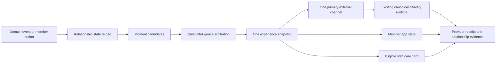

# Cloud & Core Personal Concierge Journey

## Status

Approved product direction. This document defines the product and technical design that must be
reviewed before implementation planning begins.

## Product promise

Every Cloud & Core member should feel personally known, quietly supported, and thoughtfully cared
for by Yareen.

The Concierge is not a collection of notifications. It is one continuous relationship that begins
with the member's first booking and becomes more useful as the member explicitly shares preferences
and establishes a real studio rhythm.

The experience must feel:

- personal without pretending that automation is a live human conversation;
- anticipatory without being intrusive;
- premium through relevance and restraint rather than message volume;
- coherent across the application, studio, WhatsApp, push, and email;
- trustworthy because the member can see and correct what is remembered.

## Chosen direction

The approved direction is **The Personal Thread**, supported by **Quiet Intelligence**.

The emotional promise is:

> Cloud & Core knows me, remembers me, and quietly takes care of me.

Yareen is the visible concierge voice. The system may prepare suggestions and coordinate service,
but it must not claim that Yareen personally performed an action when that is not true. Human-written
notes are visibly personal; automated concierge suggestions remain honest and explainable.

## The complete product

Notifications are doorways into the experience, not the experience itself. The product consists of
four connected surfaces backed by one shared relationship state.

### Member concierge home

The member application provides a calm, personalized home that replaces a generic notification
feed with the single most relevant moment:

1. the next thing worth the member's attention;
2. a short contextual note from the Concierge;
3. one primary action;
4. supporting information only when it helps the decision.

The page adapts throughout the relationship. It may show first-visit preparation, the next class,
a schedule recovery plan, a relevant opening, or a quiet return path. It must never become an
administrative dashboard.

### Between Us

`Between Us` is the member's private relationship space. It contains:

- Yareen's current note;
- the member's stated intentions and preferences;
- what the Concierge believes it has learned, with a confidence label;
- controls to confirm, correct, remove, or pause personalization;
- a short history of meaningful recommendations and decisions;
- personal milestones that are useful or emotionally relevant.

It is not an inbox, chat transcript, points system, or marketing feed.

### Living weekly rhythm

The application may curate a gentle weekly rhythm using the member's stated goals, availability,
confirmed preferences, bookings, and attendance:

- planned classes;
- one or two relevant alternatives;
- recovery or rest guidance when supported by approved studio content;
- interruptions that require attention;
- easy ways to adjust the plan.

The rhythm is advisory. The system must not present medical guidance or book, purchase, cancel, or
renew anything without explicit member authorization.

### Staff care card

Authorized staff receive a concise, time-bound care card before an eligible visit. It includes only
information that helps deliver the service and that the member would reasonably expect staff to
use, such as:

- first visit;
- explicitly supplied accessibility or arrival needs;
- stated communication or class preferences;
- a meaningful return after an absence;
- an approved human follow-up note.

The card excludes speculative traits, sensitive inferences, payment difficulty details, private
message history, and irrelevant engagement analytics.

## Relationship lifecycle

### Act 1: I am expecting you

The journey begins when the first booking is successfully confirmed.

- Yareen welcomes the member in their preferred language.
- The app opens directly to a first-visit concierge card.
- Preparation includes only useful arrival time, location, clothing/equipment guidance, and what
  to expect.
- The message and app use the same event snapshot so details cannot disagree.

### Act 2: You belong here

After verified attendance, the engine decides whether contact adds value.

- It may acknowledge the visit.
- It may ask one effortless, optional preference question.
- It may remain silent.
- It must never send a generic survey merely because the class ended.

Non-attendance produces a different, non-judgmental path and never pretends the visit happened.

### Act 3: I am learning what suits you

The relationship profile develops gradually from explicit preferences and repeated behavior.
Recommendations must state why they may be relevant without presenting weak inference as fact.

Example:

> You usually choose quieter evening sessions. Thursday's small reformer class may suit your
> rhythm.

The system must distinguish:

- `known`: explicitly stated or confirmed;
- `likely`: supported by a repeated pattern and phrased tentatively;
- `unknown`: not used for personalization.

### Act 4: I have got you

Operational events become service recovery moments:

- a cancelled class comes with suitable, available alternatives;
- a waitlist opening respects the member's normal schedule and contact preferences;
- a low balance is raised before it disrupts an intended booking;
- a missed visit receives kindness rather than guilt;
- an unusual absence may produce one low-pressure return path;
- sensitive or ambiguous cases are routed to staff with context.

### Act 5: You are part of Cloud & Core

The Concierge recognizes meaningful milestones such as a first month, a stable routine, returning
after a break, or progress toward an explicitly stated intention.

Recognition is understated. It must not introduce streak pressure, artificial scarcity, public
rankings, or gamification unless a future member-controlled feature explicitly supports it.

## Signature capabilities

### Next moment

At any time, the system resolves at most one primary concierge moment for the member. Lower-priority
moments are suppressed, deferred, or composed into the primary moment.

### Explainable recommendations

Every personalized recommendation stores:

- the eligible classes or actions considered;
- the member signals used;
- excluded candidates and policy reasons;
- a short member-safe explanation;
- the confidence level;
- expiration and availability conditions.

### Thoughtful Holds

Thoughtful Holds are an optional future capability for a member who explicitly enables them.

- A highly relevant opening may be held for a short, disclosed period.
- The member is told that the place is temporarily held and when it expires.
- A hold is not a confirmed booking.
- No charge, credit use, booking, or cancellation occurs without confirmation.
- Capacity, fairness, waitlist order, and studio policy remain authoritative.
- Members can disable holds at any time.

This capability must not launch in the first production release.

### Graceful recovery

When a plan is disrupted, the Concierge prepares a recovery state rather than only reporting the
problem. Alternatives must be live, eligible, and ranked using the member's confirmed constraints.
The member remains in control of the final action.

### Human handoff

The same context can be transferred to an authorized staff member without asking the member to
repeat information. A handoff records:

- why human attention is needed;
- the relevant member-visible history;
- the requested outcome;
- ownership and status;
- the final resolution.

Automated contact pauses when continuing it could conflict with an active human resolution.

## Quiet intelligence policy

Before any proactive contact or personalized surface is created, the engine evaluates:

1. Is the information true and current?
2. Is this moment meaningful now?
3. Is personalization supported by sufficient consent and confidence?
4. Is there already a higher-priority member need?
5. Which single surface or channel is best?
6. Would silence provide better service?

### Care budget

Each member has a rolling proactive-contact budget. Optional messages must reserve capacity before
materialization. Essential transactional messages do not compete with optional care, but they do
suppress nearby promotional or recommendation contact.

The budget accounts for:

- recent contacts across all channels;
- recent negative or disruptive events;
- engagement and explicit channel preferences;
- quiet hours and local timezone;
- active human conversations;
- repeated non-response.

Repeated non-engagement makes the Concierge quieter; it never increases pressure.

### Priority order

1. safety or urgent studio information;
2. imminent disruption requiring member action;
3. confirmed booking, schedule, waitlist, or payment truth;
4. first-visit and active human care;
5. service recovery;
6. member-requested planning;
7. relevant recommendation;
8. milestone recognition;
9. promotional content.

Only compatible moments may be composed. Negative events must not be bundled with promotional
content.

## Channel choreography

One event produces one coordinated experience rather than duplicated messages.

| Surface | Role |
| --- | --- |
| Member app | Live truth, actions, next moment, relationship memory, and preferences |
| WhatsApp | Personal and time-relevant moments where Yareen's presence adds value |
| Push | A quiet doorway into an app state when WhatsApp is unnecessary |
| Email | Elegant records, receipts, longer summaries, and rare reflections |
| Staff app | Time-bound care card and human handoff |

The orchestrator chooses one primary external channel. Secondary surfaces may update silently.
Every external action deep-links to the exact app state with authenticated web fallback. Generic
homepage links are not permitted.

## Minimal template architecture

Premium does not mean maintaining a large template library. The application may have many
experience states, but provider templates are created only when an external provider requires a
pre-approved message contract.

### Template budget

Phase 1 uses exactly **one logical WhatsApp template family**: the existing first-booking
confirmation, with one approved locale variant for Hebrew, Arabic, and English. The first-visit
preparation experience lives in the application. Follow-up uses in-app state or an eligible push
doorway and does not require another WhatsApp template.

No additional provider template is permitted in Phase 1 unless an end-to-end requirement cannot be
met through:

1. the existing approved template;
2. a dynamic in-app experience;
3. an existing transactional push or email contract.

Later phases add a provider template only for a materially different external communication
contract, such as an urgent class disruption or an expiring waitlist offer. Copy variation,
personalization, visual experiments, journey stage, and minor wording changes are not sufficient
reasons to create another logical template.

### Canonical contract

Each logical template family owns:

- one stable internal key;
- one provider category and purpose;
- one parameter schema;
- one action/button contract;
- native Hebrew, Arabic, and English variants;
- one active provider version;
- at most one approved rollback version during migration.

Locale variants count as one logical family in the application catalog, even though Meta approves
them separately. The catalog, presentation builder, Journey Lab, provisioning, and delivery runtime
must all read the same canonical definition.

### Creation gate

A new provider template requires a short decision record proving all of the following:

- a real customer-visible event requires external delivery;
- no existing active family can represent it truthfully and safely;
- app, push, or email cannot satisfy the timing and reliability requirement;
- its provider category, variables, locale coverage, and action are defined;
- it has an owner and a planned retirement condition;
- adding it stays within the reviewed template budget.

Without this evidence, the experience must reuse an existing contract or remain in-app.

### Version and retirement policy

- Edit internal app presentation without creating provider versions.
- Create a new provider version only when Meta requires resubmission for a material body, category,
  parameter, or button change.
- Keep the current approved version live while its replacement is reviewed.
- After rollout, retain only the active version and one rollback version in the runtime registry.
- Remove superseded versions from code, fixtures, admin selectors, and provisioning manifests after
  the rollback window.
- Provider-side historical records may remain for audit, but they are not exposed as selectable
  application templates.
- Never create parallel `basic`, `branded`, `premium`, or journey-specific variants of the same
  semantic contract.

### Repository cleanliness

- One typed registry is the source of truth for template identity and parameters.
- Localized copy is colocated by logical family rather than duplicated across delivery paths.
- Test fixtures are generated from the canonical registry.
- Preview tools use production definitions and cannot introduce preview-only templates.
- Obsolete template code is deleted after migration rather than left behind as inactive branches.
- Secrets, provider exports, generated previews, and local environment files are never committed.

The implementation plan must include a template inventory and consolidation step before adding any
new template.

## Experience states

The member concierge home resolves one of these top-level states:

- `first_visit_preparation`;
- `next_class`;
- `attention_required`;
- `recovery_options`;
- `personal_recommendation`;
- `return_gently`;
- `weekly_rhythm`;
- `human_care_active`;
- `quiet`.

Each state defines:

- eligibility and cancellation conditions;
- member-safe rationale;
- title, note, supporting facts, and primary action;
- allowed secondary actions;
- expiry;
- channel eligibility;
- whether a staff care card may be created.

The `quiet` state is a deliberate premium state. It shows a calm next-class or schedule overview
without manufacturing a message.

## Relationship data model

The implementation should extend the existing versioned Concierge architecture rather than create a
second delivery pipeline.

### Concierge relationship

One per member and studio:

- relationship stage;
- first-booking and first-attendance timestamps;
- preferred locale, timezone, and channel;
- personalization status and pause state;
- active human-care state;
- last meaningful contact;
- current top-level experience state;
- version and audit timestamps.

### Preference evidence

Each remembered item is evidence-based:

- preference key and normalized value;
- source: member, staff, booking behavior, or attendance behavior;
- confidence: known or likely;
- observation count and time window;
- member visibility;
- expiry or revalidation date;
- correction/deletion history.

Sensitive inference categories are denied by policy rather than merely hidden in the interface.

### Concierge moment

A versioned candidate for attention:

- triggering event or member request;
- journey act and experience state;
- priority and expiry;
- eligibility and cancellation conditions;
- recommendation evidence;
- proposed channel and action;
- decision status and reason.

### Member experience snapshot

An immutable rendering input shared by app and messaging:

- current truth identifiers and timestamps;
- approved relationship facts;
- localized presentation version;
- member-safe explanation;
- action destination and authorization requirements;
- channel plan;
- snapshot hash.

### Care card and human handoff

Separate records with strict authorization, purpose, expiry, access audit, and resolution.

## Architecture and integration

The existing domain outbox, versioned journey, recipient arbitration, frequency reservation,
immutable snapshot, canonical delivery, and webhook reconciliation remain authoritative.

The new product layer must not bypass:

- consent and marketing preferences;
- exact-locale approved templates;
- quiet hours and contact caps;
- allowlist, test-only, shadow, and live gates;
- current provider delivery reconciliation;
- deterministic idempotency and audit history.

The current canonical production messaging path remains active during development. New Concierge
experience states begin in shadow and test-only modes so they cannot duplicate existing customer
messages.

## Truth, concurrency, and expiry

- Availability and booking eligibility are reloaded before presenting or executing an action.
- A recommendation or recovery option expires when its underlying class, capacity, package, or
  policy changes.
- Scheduled moments store identities and cancellation conditions, not stale rendered data.
- Only one current primary experience snapshot is visible per member.
- Member actions use idempotency keys and revalidate current truth in the execution transaction.
- A stale app card resolves gracefully to a refreshed alternative rather than failing silently.

## Privacy, consent, and member control

- Personalization requires a clear member-facing explanation and controls.
- Members can inspect, correct, delete, or pause visible preference memory.
- Required service records may remain under the applicable retention policy but cannot continue to
  influence personalization after removal.
- Health, diagnosis, body-image, religion, ethnicity, financial hardship, and other sensitive traits
  are never inferred.
- Staff access follows least privilege and is audited.
- Care cards expire after their service purpose ends.
- Marketing opt-out suppresses promotional and retention recommendations without suppressing
  required operational service.

## Failure behavior

- Missing personalization data: show a useful generic app state; do not fabricate familiarity.
- Low-confidence inference: omit it or express it tentatively in-app; do not use it in an external
  message.
- Missing approved WhatsApp locale: use another consented, eligible channel only when channel policy
  explicitly permits it; otherwise suppress and create attention evidence.
- Deep-link failure: authenticated web fallback opens the same destination, never the marketing
  homepage.
- Provider ambiguity: preserve current no-blind-retry reconciliation.
- Human handoff active: suppress incompatible automation.
- Recommendation becomes unavailable: refresh alternatives before display or action.
- Relationship engine unavailable: existing operational messaging continues independently.

## Product language

Copy is authored natively in Hebrew, Arabic, and English. The voice is warm, elegant, concrete, and
restrained.

- Use the member's name only when natural.
- Never use guilt, artificial urgency, or exaggerated intimacy.
- Avoid technical terms and generic account-update language.
- Use at most one restrained emoji in an appropriate positive moment.
- Explain recommendations briefly.
- Do not repeat the studio name when sender identity already establishes it.
- Yareen's signature appears where a personal note adds meaning, not mechanically on every system
  record.

## Measurement

The system measures service quality rather than message volume:

- useful action completion;
- recommendation acceptance and later attendance;
- recovery success after disruption;
- preference corrections and personalization pauses;
- duplicate-contact rate;
- contact suppression and care-budget pressure;
- stale-action rate;
- human handoff resolution time;
- opt-out, mute, and negative feedback;
- qualitative member and staff feedback.

Open rate alone is not a success metric.

## Delivery phases

### Phase 0: Foundation and shadow evidence

- Relationship state, preference evidence, moment arbitration, experience snapshots, and audit.
- No new customer-visible delivery.
- Shadow comparison against existing live events.

### Phase 1: First booking to first attendance

- Member concierge home.
- First-visit preparation.
- Reuse only the existing first-booking WhatsApp template family across the three locales.
- Exact deep links.
- Attendance-aware follow-up or deliberate silence.
- Allowlisted end-to-end pilot in Hebrew, then Arabic and English.

### Phase 2: Between Us and member control

- Visible preference memory.
- Confirm, correct, remove, and pause controls.
- Weekly rhythm in advisory mode.

### Phase 3: Staff continuity

- Time-bound care card.
- Human handoff and automation pause.
- Staff access audit.

### Phase 4: Graceful recovery

- Live alternatives for cancellation, waitlist, and schedule disruption.
- Payment or package interruption guidance without pressure.

### Phase 5: Explainable recommendations

- Confidence policy.
- Member-safe rationale.
- Strict care budget and marketing consent.

### Phase 6: Thoughtful Holds pilot

- Explicit opt-in only.
- Fairness, capacity, expiration, and authorization controls.
- Small controlled pilot before broader availability.

Each phase progresses through shadow, allowlisted test-only, limited live pilot, and measured rollout.

## Testing strategy

### Automated

- lifecycle transitions and cancellation conditions;
- one-primary-moment arbitration;
- care-budget reservation across channels;
- known, likely, unknown, corrected, removed, and expired preference evidence;
- consent and sensitive-inference denial;
- current availability and action revalidation;
- immutable snapshot parity between app and messages;
- exact deep links and authenticated fallback;
- locale-native presentation;
- human handoff suppression;
- idempotent actions and duplicate prevention;
- continued operational messaging when the relationship layer fails.

### End-to-end

- first booking through verified first attendance;
- non-attendance branch;
- cancellation with live alternatives;
- member preference correction;
- staff care-card visibility and expiry;
- human handoff;
- WhatsApp, push, email, and app choreography;
- provider receipt reconciliation;
- opt-out and personalization pause;
- stale recommendation recovery.

### Experience review

Realistic member scenarios are reviewed for:

- emotional appropriateness;
- relevance and restraint;
- accessibility and RTL quality;
- trust and explainability;
- staff usefulness;
- whether silence would have been better.

## Acceptance criteria

- The first-booking journey is a complete in-app and service experience, not a notification series.
- App, staff, and external messages render from consistent truth.
- A member can see and control what is remembered.
- No action with financial, capacity, or booking consequences occurs without authorization.
- One event does not create duplicate cross-channel contact.
- Phase 1 introduces no new logical provider template family.
- Every active provider template has a documented purpose, owner, and retirement condition.
- The runtime registry exposes only active and temporary rollback versions.
- Negative moments suppress inappropriate promotion.
- Operational delivery remains reliable if personalization is unavailable.
- Every automated recommendation is explainable and auditable.
- The system can intentionally choose silence.
- Existing production messaging safeguards remain intact throughout rollout.

## Explicit non-goals for the first release

- open-ended AI chat;
- medical or therapeutic advice;
- autonomous booking, payment, renewal, or cancellation;
- Thoughtful Holds in general availability;
- gamification, public rankings, or streak pressure;
- replacing staff judgment;
- migrating all existing journeys to live at once;
- creating a second provider-delivery pipeline.
